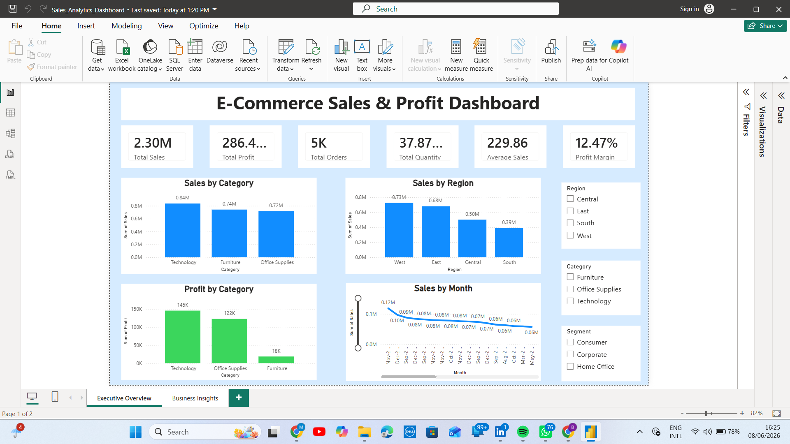
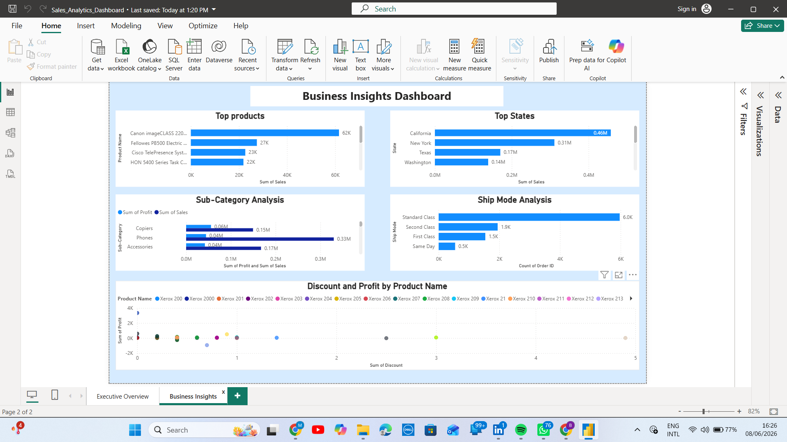

## E-commerce Sales Analysis Dashboard (End-to-End)

## Project Overview

This project is a complete end-to-end data analysis solution built using Excel, SQL, Python, and Power BI.
It transforms raw e-commerce data into meaningful insights and an interactive dashboard for business decision-making.

## Project Phases Completed

## Excel Phase (Data Preparation & Validation)

 * Loaded dataset successfully
 * Verified dataset size: 9,995 rows × 21 columns
 * Understood data structure and columns
 * Checked missing values
 * Checked duplicate records
 * Verified date columns

## Business KPIs
KPI							Value
Total Sales					2,297,200.86
Total Profit				286,397.02
Total Quantity Sold			37,873
Total Orders				5,009
Average Sales per Record	229.86

## Analysis Performed
Sales & Profit Analysis
 * Sales by Category
 * Profit by Category
 * Sales by Region
 * Profit by Region
   
## Product Analysis
 * Top 10 Products
 * Top Sub-Categories
   
## Customer Analysis
 * Sales by Customer Segment

## Trend Analysis
 * Monthly Sales Trend
 * Discount vs Profit

## Power BI Dashboard
## KPI Section
 * Total Sales
 * Total Profit
 * Total Orders
 * Total Quantity
 * Average Sales
 * Profit Margin %

 ## Visual Insights
 * Sales by Category
 * Sales by Region
 * Profit by Category
 * Monthly Sales Trend
 * Customer Segmentation
 * Discount vs Profit Impact
 * Product Performance Breakdown

 ## Dashboard Preview

### Executive Overview

### Business Insights

📌 Key Insights
 * Clear understanding of top-performing categories
 * Regional performance differences identified
 * Customer segments show distinct buying patterns
 * Discounts significantly impact profit margins
 * Strong seasonal sales trends observed

 🧰 Tools Used
Excel → Data cleaning and validation
SQL → Data querying and analysis
Python → Exploratory Data Analysis
Power BI → Dashboard and visualization
